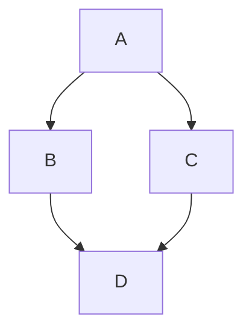

## Table of Contents

## Testing
Hey


- [Multitenancy in Databases](#multitenancy-in-databases)

- [What this Package Does](#)
    Multitenancy is about converting databases with config files. This is a minimal package which only does it for X configs.
- [Extending the Package](#) If you want to add anything to it, you put them under additional classes.
        This will register() and boot() your additional classes.
        __invoke(): used to allow your classes to get through without having to tell the package anything.

 - [Artisan]


- [Special Thanks](#)
    - Mohamed Said
    - Spatie
    - Youtube on multitenancy
  - [Testing the Package on its Own (No Laravel App Necessary)](#here-too)


An extensible multitenancy package for Laravel. This package provides 1 db per user, all on the same DB instance.

## Installation

Install the package via Composer:

```bash
composer require mgraichy/tenant-aware
```

Or, clone the package from Github for testing [without reliance on an installed Laravel app](#testing).




