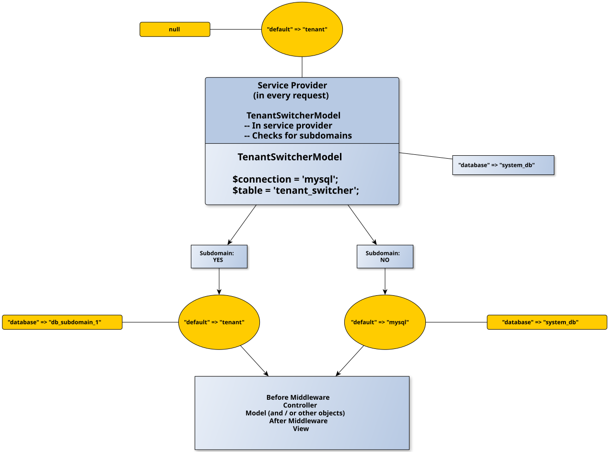

## Table of Contents
  - [Installation](#installation)
  - [Usage](#usage)
    - [Basic Usage](#basic-usage)
    - [Configuration](#configuration)
  - [Additional Features](#additional-features)
    - [Extending the Package](#extending-the-package)
    - [Artisan](#artisan)
  - [Testing](#testing)
  - [Under the Hood](#under-the-hood)
    - [Explanation](#explanation)
  - [License](#license)
  - [Acknowledgments and Resources](#acknowledgments-and-resources)

An extensible multitenancy package for Laravel which provides 1 database per subdomain of the application.


## Installation

Install the package via Composer:

```bash
composer require mgraichy/tenant-aware
```

Or, clone the package from Github for testing [without relying on an installed Laravel app](#testing).

## Usage

This package adds a `tenant_switcher` table to your database. It then uses that table to switch tenants for each subdomain on the site. For example, `subdomain1.example.com` will be a tenant with its own database, and `subdomain2.example.com` will be another tenant, which also has its own database.

You will have to create the empty databases beforehand, and fill in the `tenant_switcher` table.

### Filling In the `tenant_switcher` Table in Your System Database

  - **`tenant_name`**. The name of the company, user, or any other entity that a separate database is given to. For example, `ElePHPants Inc.`
  - **`tenant_domain`**. The full domain name, including subdomain, for this tenant, e.g. `elephpants.example.com`.
  - **`tenant_database`**. The name of the database created for this tenant, e.g. `db_elephpants`.


### Configuration

1. Change the `.env` file:
```
DB_CONNECTION=tenant
QUEUE_CONNECTION=redis
CACHE_STORE=redis
```
2. Publish the Tenant-Aware Files:
```bash
php artisan vendor:publish --tag=tenant-aware-migrations --tag=tenant-aware-subdomains
```
  - `--tag=tenant-aware-migrations`. This will publish the migration for the `tenant_switcher` table in `database/migrations/system-db`, and add a `database/migrations/tenants` directory which gives the option of migrating a specialized set of tables for tenants.
    - **`'domain'`.** Place your root domain name (e.g. `example.com`) into `config/tenant-aware.php`'s `domain` key.
    - **`'additional_classes'`.** For how to use this key, see [Extending the Package](#extending-the-package).
    - **`'tenant'`.** The pakage dynamically takes the `tenant` connection from this file and puts it into the `DatabaseManager` inside Laravel's service container on every request.
  - `--tag=tenant-aware-subdomains`. This publishes the configuration file to `config/tenant-aware.php` and the routes file to `routes/subdomains.php`.

## Additional Features


### Artisan

The `tenants:foreach` Artisan command has been designed to allow any Artisan command to also be run on a per-tenant basis.

Abstractly, here's the prototype:

```bash
php artisan tenants:foreach \
    <artisan-command> \
    --params='<parameter-for-artisan-command>="<value>" <param2>="<value2>" ...' \
    --tenant=<tenant_switcher.id|tenant_switcher.tenant_name>
```

Concretely, here's what you can type into the shell to install the `tenant_switcher` table:

```bash
php artisan tenants:foreach \
    migrate \
    --params='--path="database/migrations/system-db" --realpath'
```


### Extending the Package

Create additional classes anywhere in your container and dynamically import them into this package. These classes will then be `register()`ed and `boot()`ed as though you had created an additional service provider.

Let's run through exactly how this is done:

```php
// config/tenant-aware.php:
return [
    'domain' => 'example.com',

    'additional_classes' => [

        [
            'FQCN' => \App\TenantAware\ClassOne::class,
        ],

        [
            'FQCN' => \App\TenantAware\ClassTwo::class,
            '__construct-params' => [
                'some string',
                \App\Models\User::class,
            ],
            '__invoke-params' => [
                [4, 5, 6]
            ],
        ],
    ],

    'tenant' => [/*...*/],
];
```

  - Put the class(es) you've defined within the file, as above.
    - **`'FQCN'`.** The fully-qualified class name of each class you include in this file (if any).
    - **`'__construct-params'`.** Any parameters used in the class(es)' constructor.
    - **`'__invoke-params'`.** Any parameters necessary for the `__invoke()` method of this class.
  - **Motivation for the `__invoke()` Magic Method.** Including an `__invoke()` method maintains the developer's hook into the package itself, without the package needing to know the name(s) of the method(s) to call.
  - **Motivation behind Using Arrays rather than Collections.** Arrays are much more time-efficient than collections, which are wrappers around the array.
    - Arrays were chosen because they are being used only as a way to move data to the service provider (and not to transform that data in any way with a collection).


## Testing

If you want to test this before installation, clone this repository from Github (`github.com/mgraichy/tenant-aware`) and run a basic test with the CLI, switching to this package's directory and running: `vendor/bin/pest`.

Packages used: the [Orchestral Testbench](https://github.com/orchestral/testbench), which itself uses [PHPUnit](https://phpunit.de/index.html) and a minimal implementation of Laravel so that you don't need a full Laravel installation, and the [wonderful Pest package](https://pestphp.com/).

You also don't need to create actual subdomains or alter e.g., the `/etc/hosts` file in your dev environment because Laravel testing is ultimately based on [Symfony's BrowserKit](https://symfony.com/doc/current/components/browser_kit.html), which doesn't use networking in its requests but runs your code as though it did.


## Under the Hood

This section provides a deeper dive into how the package operates under the hood. Below is a diagram illustrating the interactions within the package:

<div align="center">
    
</div>


### Explanation

**There are 2 Connections for Every Request.**

  - **The `TenantSwitcherModel` from the Package's Service Provider.** This determines whether the default connection will:
    - Switch to `"mysql"` (database: your system DB), which happens when a subdomain is not provided by the enduser in the browser's URL bar, or
    - Remain as `"tenant"`, yet switch its database from `null` to the tenant's database which was gotten from the `tenant_switcher` table.


## License

This package is licensed under [The MIT License](https://opensource.org/license/mit).


## Acknowledgments and Resources

- [Tom Schlick](https://www.youtube.com/watch?v=UgWpS4xBiuU) gives a clear general overview of multitenancy.
- [Mohamed Said](https://www.youtube.com/watch?v=592EgykFOz4&list=PLC7jp2b5k85IPcoOrb8T6dYK6zYTMIIui) also gives a very clear explanation of how Laravel's databases work behind the scenes.
- [Freek Van der Herten](https://github.com/spatie/laravel-multitenancy) shared both Spatie's implementation of multitenancy (which he initially created), and other implementations as well.
- Finally, for (at least some) other definitions of multitenancy, see [here](https://daily.dev/blog/multi-tenant-database-design-patterns-2024) and [here](https://lobster1234.github.io/2016/11/03/multitenant-mysql/).
